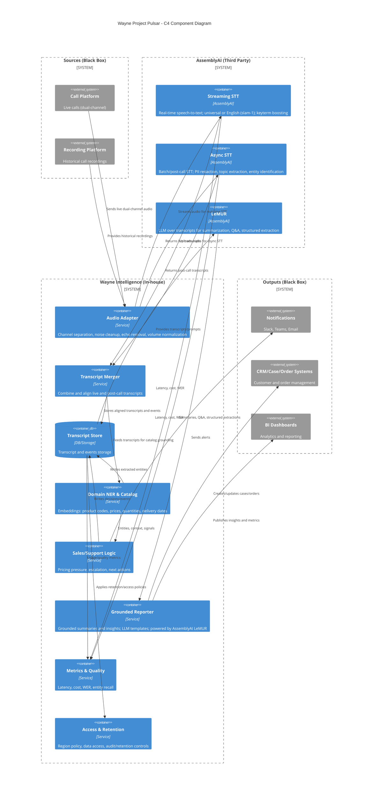

Note: You can copy/paste this diagram into [mermaid.live](https://mermaid.live) for an interactive experience.

```mermaid
C4Component
title Wayne Project Pulsar - C4 Component Diagram

%% External Sources (Black Box)
System_Boundary(sources, "Sources (Black Box)") {
  System_Ext(calls, "Call Platform", "Live calls (dual-channel)")
  System_Ext(recs, "Recording Platform", "Historical call recordings")
}

%% Third Party: AssemblyAI
System_Boundary(assembly, "AssemblyAI (Third Party)") {
  Container(streaming, "Streaming STT", "AssemblyAI", "Real-time speech-to-text; universal or English (slam-1); keyterm boosting")
  Container(async, "Async STT", "AssemblyAI", "Batch/post-call STT; PII redaction, topic extraction, entity identification")
  Container(lemur, "LeMUR", "AssemblyAI", "LLM over transcripts for summarization, Q&A, structured extraction")
}

%% In-house Platform
System_Boundary(inhouse, "Wayne Intelligence (In-house)") {
  Container(adapter, "Audio Adapter", "Service", "Channel separation, noise cleanup, echo removal, volume normalization")
  Container(merge, "Transcript Merger", "Service", "Combine and align live and post-call transcripts")
  ContainerDb(store, "Transcript Store", "DB/Storage", "Transcript and events storage")

  %% Wayne Intelligence components
  Container(domainner, "Domain NER & Catalog", "Service", "Embeddings: product codes, prices, quantities, delivery dates")
  Container(bizlogic, "Sales/Support Logic", "Service", "Pricing pressure, escalation, next actions")
  Container(reporter, "Grounded Reporter", "Service", "Grounded summaries and insights; LLM templates; powered by AssemblyAI LeMUR")

  %% Ops and Governance
  Container(metrics, "Metrics & Quality", "Service", "Latency, cost, WER, entity recall")
  Container(security, "Access & Retention", "Service", "Region policy, data access, audit/retention controls")
}

%% Outputs (Black Box)
System_Boundary(outputs, "Outputs (Black Box)") {
  System_Ext(alerts, "Notifications", "Slack, Teams, Email")
  System_Ext(crm, "CRM/Case/Order Systems", "Customer and order management")
  System_Ext(bi, "BI Dashboards", "Analytics and reporting")
}

%% Relationships: Sources -> In-house
Rel(calls, adapter, "Sends live dual-channel audio")
Rel(recs, adapter, "Provides historical recordings")

%% Relationships: In-house <-> AssemblyAI
Rel(adapter, streaming, "Streams audio for real-time STT")
Rel(adapter, async, "Uploads audio for async STT")
Rel(streaming, merge, "Returns live transcripts")
Rel(async, merge, "Returns post-call transcripts")
Rel(merge, store, "Stores aligned transcripts and events")

%% Wayne Intelligence processing
Rel(merge, domainner, "Feeds transcripts for catalog grounding")
Rel(domainner, bizlogic, "Entities, context, signals")
Rel(domainner, store, "Writes extracted entities")
Rel(bizlogic, store, "Writes decisions/events")

%% LeMUR usage
Rel(store, lemur, "Provides transcripts/prompts")
Rel(lemur, reporter, "Summaries, Q&A, structured extractions")

%% Outputs
Rel(bizlogic, alerts, "Sends alerts")
Rel(reporter, crm, "Creates/updates cases/orders")
Rel(reporter, bi, "Publishes insights and metrics")

%% Ops and Governance
Rel(streaming, metrics, "Latency, cost, WER")
Rel(async, metrics, "Latency, cost, WER")
Rel(store, metrics, "Usage/quality metrics")
Rel(store, security, "Applies retention/access policies")
```